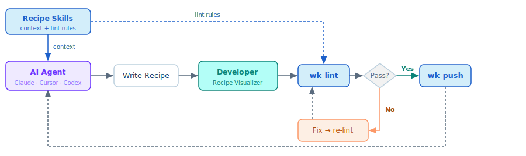

# Workato Labs

**Build recipes with the AI coding tools you already use.**

An open-source developer toolkit for building, validating, visualizing, and managing Workato recipes — designed for humans and coding agents alike.

---

## The workflow

Four tools that replace the loop of guess, push, break, repeat — one quality loop shared by a human developer and a coding agent.

<p align="center">
  
</p>

**Agent writes recipe** (recipe-skills) → **Developer inspects** (visualizer) → **Linter validates** (`wk lint`) → **CLI pushes** (`wk push`)

---

## Install the toolkit

Four steps, each using a command you already know. No install scripts, no ambient dependencies, no magic.

### 1. Install the CLI

A unified CLI for Workato platform operations and recipe development. Single binary, no dependencies.

**macOS (Homebrew):**

```bash
brew install workato-devs/tap/wk
wk version
```

**Windows (Scoop):**

```powershell
scoop bucket add workato-devs https://github.com/workato-devs/scoop-bucket
scoop install wk
wk version
```

<details>
<summary>Manual install</summary>

Download and extract the binary for your platform from [Releases](https://github.com/workato-devs/wk/releases), then:

```bash
xattr -d com.apple.quarantine /path/to/wk      # macOS: allow the binary to run
sudo mv /path/to/wk /usr/local/bin/
wk version
```

> **Tip:** Right-click the extracted binary in Finder and hold Option to copy its full path.

</details>

### 2. Install the recipe linter

Deterministic validation — catches errors that agent self-validation misses.

**macOS (Homebrew):**

```bash
brew install workato-devs/tap/recipe-lint
wk plugins install recipe-lint
```

**Windows (Scoop):**

```powershell
scoop install recipe-lint
wk plugins install recipe-lint
```

<details>
<summary>Manual install</summary>

Download and extract the archive for your platform from [Releases](https://github.com/workato-devs/recipe-lint/releases). The binary inside is named `recipe-lint` (not `wk-lint`).

```bash
sudo mv /path/to/extracted-folder /usr/local/lib/recipe-lint  # move to a permanent location
sudo xattr -rd com.apple.quarantine /usr/local/lib/recipe-lint  # macOS: allow the binary to run
sudo ln -s /usr/local/lib/recipe-lint/recipe-lint /usr/local/bin/recipe-lint  # symlink so wk can find the plugin
wk plugins install recipe-lint
which recipe-lint
```

> **Tip:** Right-click the extracted binary in Finder and hold Option to copy its full path.

</details>

### 3. Clone the recipe skills

Agent-consumable knowledge for recipe authoring — connector config, datapill syntax, control flow, schemas. Also where connector-specific lint rules live. Point your coding agent here.

```bash
git clone https://github.com/workato-devs/recipe-skills.git
```

### 4. Install the recipe visualizer

IDE extension that renders recipe JSON as interactive workflow graphs. Works in VS Code, Cursor, and Windsurf.

Install from your editor's marketplace — search **Recipe Visualizer** in the Extensions panel ([VS Code Marketplace](https://marketplace.visualstudio.com/items?itemName=WorkatoLabs.recipe-visualizer) · [Open VSX](https://open-vsx.org/extension/WorkatoLabs/recipe-visualizer)), or from the command line:

```bash
# VS Code
code --install-extension WorkatoLabs.recipe-visualizer

# Cursor / Windsurf use the same command
cursor --install-extension WorkatoLabs.recipe-visualizer
```

<details>
<summary>Manual install (.vsix)</summary>

Download the latest `.vsix` from the [recipe-visualizer releases](https://github.com/workato-devs/recipe-visualizer/releases), then:

```bash
# VS Code — replace code with cursor or windsurf as needed
code --install-extension ./recipe-visualizer-1.0.0.vsix
```

</details>

---

## What's in the box

Each tool covers a piece of the developer lifecycle. Together, they replace manual recipe wrangling with an agent-native development flow.

**wk CLI** · Go
A unified CLI for Workato platform operations and recipe development. `wk pull`, `wk push`, `wk diff`, and `wk status` across workspaces. Plugin system for extending with custom commands.

**Recipe Linter** · Go
Deterministic validation via `wk lint`. Catches datapill syntax errors, schema mismatches, and structural issues that agents can't self-validate.

**Recipe Skills** · Markdown
Agent-consumable knowledge for recipe authoring. Connector config, datapill syntax, control flow, error handling. Also home to connector-specific lint rules. Point your coding agent at the skills directory.

**Recipe Visualizer** · VS Code extension
IDE extension rendering recipe JSON as interactive workflow graphs. Click a node, navigate to the source. Export graphs as images. VS Code, Cursor, Windsurf.

---

## Repositories

| Repo | Description |
|------|-------------|
| [workato-labs](https://github.com/workato-devs/labs) | Hub — landing site, docs, install guide |
| [wk](https://github.com/workato-devs/wk) | CLI — Go binary, workspace ops |
| [recipe-skills](https://github.com/workato-devs/recipe-skills) | Agent knowledge — connector skill sets |
| [recipe-lint](https://github.com/workato-devs/recipe-lint) | Recipe linter — deterministic validation |
| [recipe-visualizer](https://github.com/workato-devs/recipe-visualizer) | IDE extension — interactive recipe graphs |

---

## Feedback

Workato Labs is an open-source initiative from Workato. Community feedback welcome, no SLA.

File issues here for general toolkit feedback, or on the individual repos for tool-specific bugs.

[Join the conversation →](https://github.com/workato-devs/labs/discussions)
